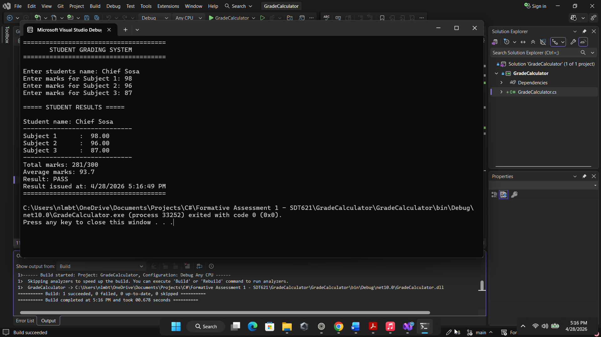
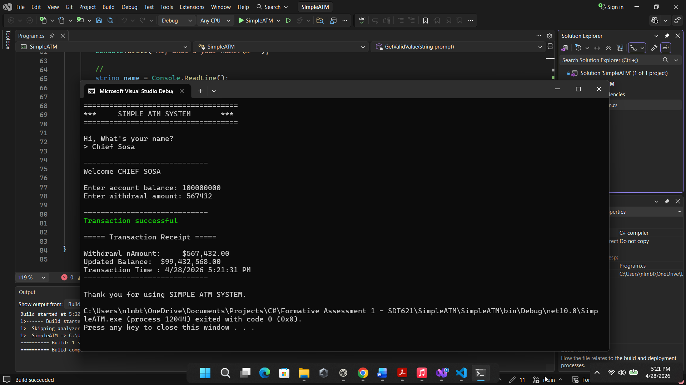
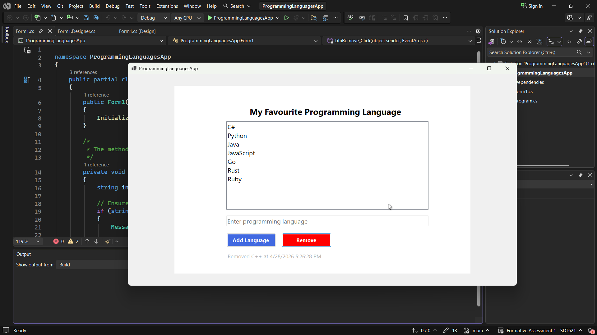
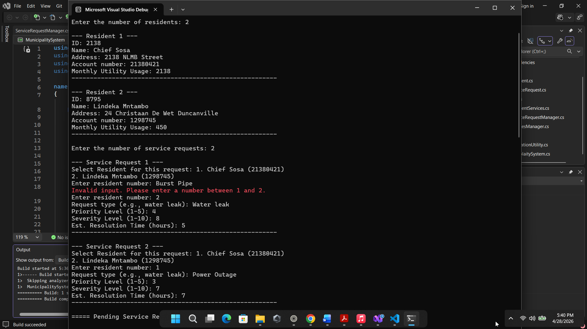
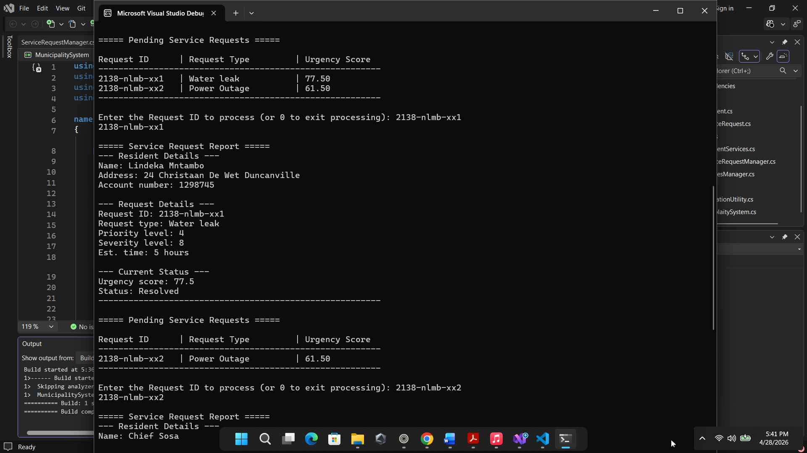
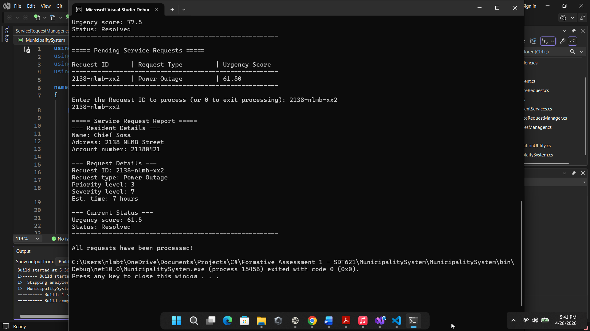
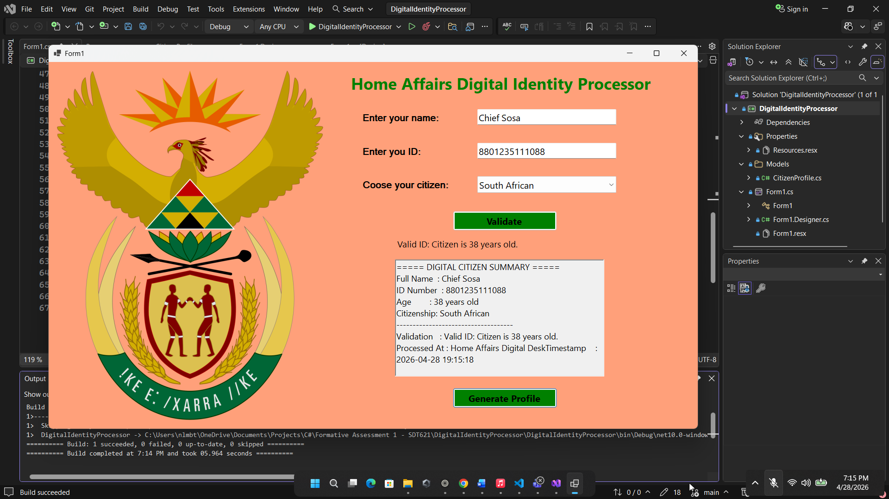

## Section A: Short Answer Questions

### Question 1: Student Marks Calculator (Console Application)

This console program prompts the user for a student's name and three subject marks. It validates that the marks are numeric, computes the total and average, and determines a PASS or FAIL status based on an average of 50 or higher. Results are displayed in a clear, formatted output.

    

**Key Features:**

- Robust input validation using `double.TryParse`.
- Calculation of total and average marks.
- Conditional logic for PASS/FAIL determination.
- Formatted console output.

**Usage:**
Run the application and follow the on-screen prompts for student details and marks.

### Question 2: Simple ATM Console Application

This program simulates a basic banking withdrawal transaction. It maintains an initial account balance, allows the user to input a withdrawal amount (with basic validation), updates the balance, and displays the transaction details including the new balance and current date/time.

    

**Key Features:**

- Secure-like input for withdrawal amounts.
- Balance validation to prevent overdrafts.
- Use of `DateTime.Now` for transaction timestamp.
- Clear transaction summary output.

**Usage:**
Launch the console app, enter the withdrawal amount when prompted, and review the updated balance and timestamp.

### Question 3: Programming Languages Manager (Windows Forms App)

This Windows Forms application allows users to manage a list of programming languages. Users can add new languages (with checks for empty input and duplicates), remove selected items, and view the list. The application also displays the current date and time of modifications.

    

**Key Features:**

- `ListBox` for dynamic item management.
- Validation to prevent empty or duplicate entries.
- Button events for add/remove actions.
- Real-time date/time display using a `Label` or `Timer`.

**Usage:**
Enter a language name in the TextBox, click "Add" (validations apply automatically), select an item and click "Remove". The timestamp updates on actions.

## Section B: Long Answer Questions

### Question 1: Emfuleni Municipality Console Application (OOP Design)

This console-based system manages resident information and utility service requests for Emfuleni Municipality. It uses object-oriented principles with dedicated classes for residents, service requests, and processing logic.

    
    
    

**Classes:**

- **Resident.cs**: Stores name, address, account number, and monthly utility usage.
- **ServiceRequest.cs**: Captures request type, priority (1-5), severity (1-10), estimated resolution time, and links to a resident.
- **UtilitiesManager.cs**: Calculates urgency scores (e.g., based on priority × severity) and generates reports.
- **Program.cs**: Handles user input for multiple residents and requests, displays a prioritized queue, processes requests interactively, and produces a final summary including the highest urgency request.

**Workflow:**

1. Input number of residents and their details.
2. Input number of service requests with associations to residents.
3. Display pending requests with urgency scores.
4. Interactively process requests.
5. Generate detailed reports and overall summary.

**Key Features:**

- Encapsulation and class responsibilities following OOP principles.
- Urgency scoring algorithm (custom implementation: e.g., `urgency = priority * severity + estimatedHours` adjustment).
- Interactive queue processing with console menus.

### Question 2: HomeAffairsDigitalIdentityProcessor (Windows Forms Application)

This GUI application processes digital citizen profiles for a Home Affairs-like system. It includes input fields for name and ID number, a ComboBox for citizenship status, validation logic, and profile generation.

    

**Core Component:**

- **CitizenProfile.cs**: Class with properties for FullName, IDNumber, Age, and CitizenshipStatus. Includes:
  - Constructor that triggers age calculation.
  - Age calculation from South African ID format (first 6 digits YYMMDD, handling 19xx/20xx century logic).
  - `ValidateID()` method: Checks for exactly 13 numeric digits and incorporates age validation.

**GUI Elements:**

- Labels and TextBoxes for name and ID.
- ComboBox with options: Citizen, Permanent Resident, Visitor.
- Buttons: "Validate ID" and "Generate Profile".
- Multi-line TextBox/Label for results and timestamps.

**Functionality:**

- On "Validate ID": Instantiates `CitizenProfile`, runs validation, and displays messages (e.g., "Valid ID" or specific error).
- On "Generate Profile": Outputs a formatted summary including name, ID, calculated age, citizenship, validation status, and processing timestamp.

**Key Features:**

- South African ID parsing logic for birth date and age.
- Input validation for numeric length and content.
- Event-driven updates in the Windows Forms interface.

## Technologies Used

- **Language**: C# (.NET Framework / .NET 6+ compatible)
- **IDE**: Visual Studio (recommended for WinForms projects)
- **Paradigms**: Procedural (console), Object-Oriented Programming (OOP), Event-Driven (WinForms)
- **Key .NET Features**: Input parsing (`TryParse`), collections, DateTime, Windows Forms controls

## Setup and Running the Projects

1. Clone the repository:
2. Open the solution or individual projects in Visual Studio.
3. For console apps: Build and run via F5 or `dotnet run`.
4. For WinForms apps: Ensure the designer loads correctly and run the form.

Each project is self-contained with its own `Program.cs` or main form entry point.

## License

This repository is for educational purposes. Feel free to use as a reference for learning C# concepts.
